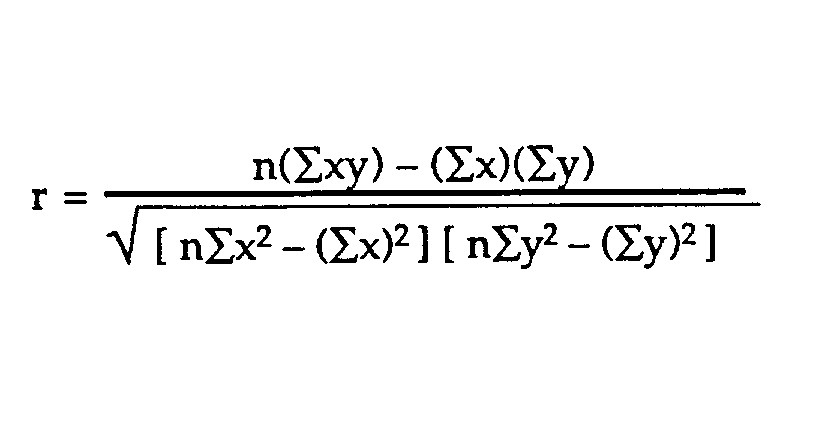
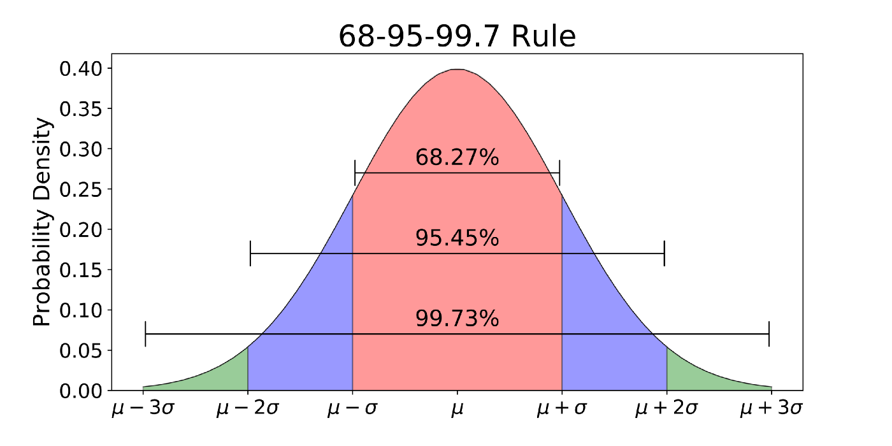

## Hypothesis testing: Getting from data to conclusion


1. We have a theory about a cause and effect
2. Start with a sample of data from a population (experimental or observational)
3. Do some summary statistics 
4. Find *correlations* in variables of interest
5. Is the correlation the result of random chance?

        + Null hypothesis: The correlation is due to random chance. There is no causal relationship
        + Alternative hypothesis: This is our theory, that there is a causal relationship that is not due to random chance
        + We apply a statistical test to determine
        + If it is statistically not due to random chance, we **reject the null hypothesis**
        + Degree of certainty - p-value (.05)

6. Where does this statistical test come from? 

        + From our knowledge of frequency distributions
        + We know the probability of being at any point on the curve
        

### Correlations

+ What is it?
+ 1 is perfect positive correlation

        + It doesn't mean you just multiply times 1 and get the other
        + The relationship can be complex
        + It just means there is no variation at all in the relationship
        
+ 0 is perfectly uncorrelated
+ -1 is a perfect negative correlation
+ Many ways to figure it. Probably the most common is Pearson's Correlation Coefficient:



+ This is the default method when using the *cor()* function in R

### Getting from frequency distribution to population estimates to hypothesis testing. Step 1 - 68-95-97 and the Z-score

+ Before we get to hypothesis testing, we also need to understand a bit more about sample vs population statistics 
+The z-score tells us tells us how close the estimate we create from the sample is to reality 
+ the number of *standard errors* between the sample mean and the population mean
+ The *z-score* is tied to standard deviation through the *standard error*. Why?
+ The **68-95-99.7** rule
        
        + Because of the characteristics of the normal distribution it can be proven (mathematically) that
        + 68% of values are within one standard deviations of the mean
        + 95% of values are within two standard deviations of the mean
        + 99.7% of values are within three standard deviations of mean
        
```{r}

# x<-rnorm(100000,mean=10, sd=2)
# hist(x,breaks=50, xlim=c(0,20),freq=FALSE, main = "Normal Distribution \n mean = 10, sd =2", col = "yellow")
# abline(v=10, lwd=5)
# abline(v=c(4,6,8,12,14,16), lwd=3,lty=3)
# text(10,.3, labels = "mean", col = "red")

```



[Source:https://towardsdatascience.com/understanding-the-68-95-99-7-rule-for-a-normal-distribution-b7b7cbf760c2](https://towardsdatascience.com/understanding-the-68-95-99-7-rule-for-a-normal-distribution-b7b7cbf760c2)

        + When estimating the population from sample data, we want to know how likely it is that our estimate is correct
        + When testing hypotheses, we want a measure of the possibility that our result is due to random chance
        + We will reject the null if the possibility it was due to random chance is .05 or less

+ The z-score tied to the standard deviation: How?

        + We need one more statistic to get there - the *standard error*
        + We'll pick up with that Monday

        
        
## Sample vs Population

## Standard Error

